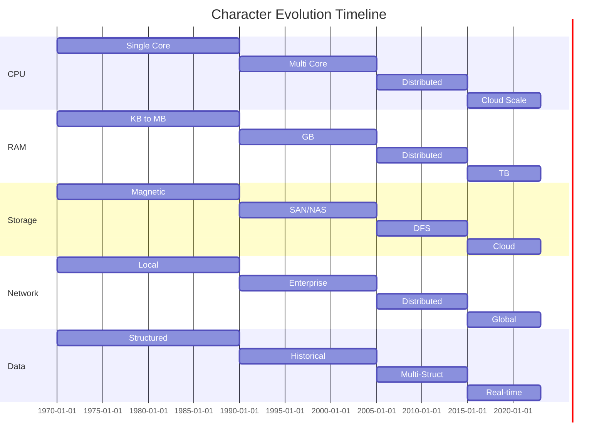
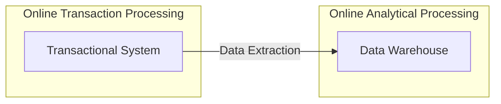
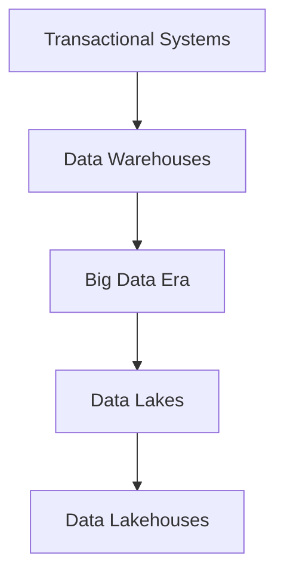

# The Evolution of Data Management: From Transactions to Lakehouses

## The Data Evolution

The journey of data management is a story of continuous adaptation to the changing needs of businesses and the relentless march of technology. It begins in an era where computing resources were scarce and expensive, demanding careful planning and meticulous execution.

In the early days, data was primarily structured and transactional, supporting core business processes like accounting, inventory, and order management. These Transactional Systems were characterized by their focus on data integrity and reliability, adhering to the ACID properties: Atomicity, Consistency, Isolation, and Durability. Data was carefully normalized to minimize redundancy and optimize storage utilization.

As businesses grew and the volume of data increased, the need for analytical insights became apparent. This led to the rise of Business Intelligence (BI) and Data Warehouses, which provided a centralized repository for historical data. Data was extracted, transformed, and loaded (ETL) into these warehouses, often using star or snowflake schemas to facilitate efficient querying and reporting.

The advent of the internet and the proliferation of digital devices brought about an explosion of data, much of it unstructured or semi-structured. Traditional Data Warehouses struggled to cope with this new reality, leading to the emergence of Data Lakes. These lakes offered a flexible and scalable way to store vast amounts of data in its raw format, without imposing a rigid schema.

However, the lack of structure and governance in Data Lakes often led to data quality issues and difficulties in data discovery and utilization. This gave rise to the Data Lakehouse, a hybrid architecture that combines the best features of Data Lakes and Data Warehouses. By leveraging modern data formats, metadata management, and governance frameworks, the Data Lakehouse enables organizations to store, process, and analyze all types of data in a unified and efficient manner.

*For a chronological view of the evolution, see the [Data Management Timeline](./data_management_timeline.md).*

## The Early Era: Transactional Systems and Structured Data

### The Characters: CPU, RAM, Persisted Storage, Network, and Data

In the early days of data management, several key characters played crucial roles:

1. **CPU (Processing Power)**: Limited and costly, CPUs were used sparingly and only for essential tasks. Much of the data preprocessing was done manually to optimize CPU usage.
2. **RAM (Processing Space)**: Small and expensive, RAM constrained the size of processes and algorithms, necessitating efficient memory usage.
3. **Persisted Storage**: Cheaper than CPU and RAM but much slower, persisted storage was used for long-term data retention.
4. **Network (Interconnect)**: Slow and short-ranged, networks kept components close together, often within the same physical box.
5. **Data**: The main character, data was mostly hand-typed and highly structured. As the other four characters became cheaper, faster, and larger, data grew in volume, variety, and velocity (the 3 V's).

### Character Evolution Through the Eras

As our story unfolds, each character undergoes significant transformation, influencing and being influenced by the others:

1.  **CPU Evolution**:
    *   Early Era: Single-core, expensive, limited processing. *Human preprocessing was key due to CPU constraints.*
    *   Data Warehouse Era: Multi-core processors, specialized OLAP operations. *CPUs began to handle more complex analytical queries.*
    *   Big Data Era: Distributed processing, parallel computing. *The rise of frameworks like MapReduce leveraged distributed CPUs.*
    *   Modern Era: Cloud-scale processing, specialized AI/ML processors. *Cloud computing provides virtually limitless CPU resources.*

2.  **RAM Evolution**:
    *   Early Era: Kilobytes to Megabytes, expensive. *Limited RAM necessitated efficient algorithms and data structures.*
    *   Data Warehouse Era: Gigabytes, columnar storage. *Larger RAM allowed for in-memory analytics and columnar data formats.*
    *   Big Data Era: Distributed memory management. *Frameworks like Spark managed memory across distributed clusters.*
    *   Modern Era: Terabytes, in-memory processing. *In-memory databases and processing frameworks became feasible.*

3.  **Persisted Storage Evolution**:
    *   Early Era: Magnetic disks, structured files. *Storage was slow and expensive, favoring structured data and normalization.*
    *   Data Warehouse Era: SAN/NAS, optimized for OLAP. *Storage solutions were optimized for analytical workloads.*
    *   Big Data Era: Distributed file systems, commodity hardware. *Hadoop and other distributed systems leveraged cheaper commodity storage.*
    *   Modern Era: SSD, cloud storage, object stores. *Cloud storage offers scalable and cost-effective storage solutions.*

4.  **Network Evolution**:
    *   Early Era: Local connections, low bandwidth. *Limited network capabilities kept systems tightly coupled.*
    *   Data Warehouse Era: Enterprise networks, data centers. *Data centers enabled larger-scale data warehousing.*
    *   Big Data Era: Distributed systems, rack awareness. *Networks became critical for distributed processing frameworks.*
    *   Modern Era: Cloud interconnects, global networks. *Cloud networks provide high-bandwidth, low-latency connections globally.*

5.  **Data Evolution**:
    *   Early Era: Structured, manually entered. *Data was carefully curated and structured due to limitations in storage and processing.*
    *   Data Warehouse Era: Historical, aggregated. *Data warehouses focused on historical and aggregated data for BI.*
    *   Big Data Era: Multi-structured, machine-generated. *The volume and variety of data exploded with the rise of the internet and sensors.*
    *   Modern Era: Real-time, streaming, AI-generated. *Data is now generated in real-time and often used for AI/ML applications.*

### Costly Beginnings and Selective Storage

In the early days, storage and processing were expensive. Organizations focused on keeping only the most essential data using techniques like **normalization**—a method to reduce redundancy and optimize storage. At that time, every piece of data mattered.

### Building Trust Through Reliable Transactions

During this period, businesses also worked hard to gain customer trust for online interactions. To achieve this, they relied on strong transaction management following the [ACID](https://en.wikipedia.org/wiki/ACID) principles—**Atomicity, Consistency, Isolation, Durability**. Relational Database Management Systems ([RDBMS](https://en.wikipedia.org/wiki/Relational_database)) used normalization along with ACID-compliant transactions to ensure data reliability. Because all the data was highly structured, these systems were known as **transactional systems**.

## The Rise of Business Intelligence and Data Warehouses

### Accumulating Data Across Time and Regions

As companies grew, they started accumulating vast amounts of data across different regions and business partners. With more data available, businesses recognized the need to analyze this information to extract actionable insights. This need led to the development of Business Intelligence (BI) tools that could process large volumes of structured data.

### The Birth of Data Warehouses

To support BI, **data warehouses** were created. These centralized repositories stored large amounts of data, often using designs like **star** and **snowflake schemas** to improve performance—at times by deliberately introducing redundancy. To balance performance with data quality, organizations segregated their systems:
- **Online Transaction Processing (OLTP)** systems handled day-to-day transactions.
- **Online Analytical Processing (OLAP)** systems managed complex analytical queries.

This segregation, known as the OLTP-OLAP model, ensured that transactional systems maintained data integrity while data warehouses provided a foundation for robust analytics. For more details on data warehouses, see [Data Warehouse on Wikipedia](https://en.wikipedia.org/wiki/Data_warehouse).

### Diagram: OLTP and OLAP Segregation

## Technological Advances and the Big Data Revolution

### Hardware Improvements and Optimization Techniques

With time, technological improvements—such as cheaper RAM and persistent storage—allowed both OLTP and OLAP systems to scale. However, even as storage became more affordable, it remained relatively slow. Engineers introduced techniques like network storage, innovative file formats, caching, and cost-based query optimization to bridge the gap between cost and performance.

### The Shift Toward Big Data

Until then, many types of data were often ignored or discarded. Data such as website traffic, system logs, sensor outputs, audio, video, transcripts, and user demographics were stored in unstructured formats and were not integrated into transactional systems. As processing power increased and storage became even cheaper, organizations began mining this previously discarded data. This shift marked the onset of the [Big Data](https://en.wikipedia.org/wiki/Big_data) era, where frameworks like [MapReduce](https://en.wikipedia.org/wiki/MapReduce) allowed distributed processing of enormous data volumes.

### From MapReduce to Apache Spark

The arrival of faster persistent storage like SSDs and the growth of cloud computing led to the development of frameworks such as [Apache Spark](https://spark.apache.org/). Spark’s lazy evaluation model allowed for more efficient processing and challenged the old assumption that data must be fully modeled (schema-on-write) before use.

## The Paradigm Shift: Schema-on-Read and Embracing Unstructured Data

### Rethinking Data Structure

As hardware and processing became more efficient, the traditional approach of structuring data in advance was reexamined. The concept of **schema-on-read** emerged—storing data in its raw form and defining its structure only when needed for analysis. This approach proved particularly valuable for industries like e-commerce, digital delivery, ride-sharing, and subscription services, where speed and flexibility were key.

### Business Implications of Schema-on-Read

By adopting schema-on-read, businesses could store data immediately as it arrived, generating insights more rapidly than competitors. This shift allowed companies to adapt their strategies dynamically, ensuring they were ready to meet market demands without waiting to rigidly model every piece of data.

## The Emergence of Data Lakes

### Storing Everything Together

The need to store both structured and unstructured data led to the development of the **data lake**. A data lake allows organizations to store data in its native form, whether structured, semi-structured, or unstructured. This flexibility ensures that valuable data—once discarded—can now be harnessed for insights. More about data lakes can be found on [Wikipedia’s Data Lake page](https://en.wikipedia.org/wiki/Data_lake).

### The Downside: Data Swamps

While data lakes provided a cost-effective solution for large-scale storage, they also introduced challenges. Without proper management, data lakes could become disorganized, leading to issues with data quality and governance. Poorly managed data lakes were sometimes referred to as "data swamps."

## The Rise of Data Lakehouses: Bridging the Gap

### Finding a Middle Path

The shortcomings of traditional data warehouses and ungoverned data lakes led to the development of a hybrid solution: the **data lakehouse**. This approach seeks to combine the storage flexibility of data lakes with the structure, governance, and analytics capabilities of data warehouses. Learn more about data lakehouses in the [Databricks Glossary](https://databricks.com/glossary/data-lakehouse).

### The Critical Role of a Metadata Layer

A robust metadata layer is key to the data lakehouse architecture. This layer manages schema design, enforces data quality, and ensures governance, providing the benefits of ACID transactions even with asynchronous, raw data ingestion. This architecture allows organizations to enjoy the best of both worlds: flexibility and reliability.

### Modern Implementations: Apache Iceberg

Technologies like [Apache Iceberg](https://iceberg.apache.org/) exemplify the data lakehouse approach by providing efficient, scalable table formats for large analytic datasets. These technologies ensure that data remains consistent and reliable as it is updated concurrently. Despite advances by major players like [Oracle](https://www.oracle.com/database/) and cloud-native solutions like [Snowflake](https://www.snowflake.com/), many challenges in data governance remain—underscoring the importance of a balanced, unified approach.

### Diagram: The Evolution of Data Management

## Data Governance and Metadata Management in Data Lakehouses

### The Importance of Data Governance

Data governance is crucial for ensuring data quality, compliance, and trustworthiness within a data lakehouse. Effective data governance policies define who can access what data, how data should be used, and how data quality is monitored and maintained.

### Metadata Management

Metadata management involves cataloging, organizing, and enriching metadata to provide context and enable data discovery. A well-managed metadata layer helps users understand the data's origin, meaning, and quality, making it easier to find and use the right data for their needs.

### Data Quality

Maintaining high data quality is essential for reliable analytics and decision-making. Data quality checks, data validation, and data cleansing processes should be integrated into the data lakehouse architecture to ensure that data is accurate, complete, and consistent.

## Real-World Use Cases of Data Lakehouses

### E-commerce

E-commerce companies use data lakehouses to analyze customer behavior, personalize recommendations, optimize pricing, and improve supply chain management. By combining transactional data with web analytics and customer feedback, they can gain a holistic view of their business and make data-driven decisions.

### Healthcare

Healthcare organizations leverage data lakehouses to integrate patient data from various sources, such as electronic health records, medical imaging, and wearable devices. This enables them to improve patient care, optimize clinical workflows, and conduct research on disease patterns and treatment outcomes.

### Financial Services

Financial institutions use data lakehouses to detect fraud, manage risk, comply with regulations, and personalize customer experiences. By analyzing transactional data, market data, and customer data, they can identify suspicious activities, assess risk exposures, and offer tailored financial products and services.

## The Role of AI and Machine Learning in Data Lakehouses

### AI/ML Integration

Data lakehouses provide a unified platform for storing and processing the large datasets required for AI and ML applications. By integrating AI/ML tools and frameworks with the data lakehouse, organizations can build and deploy machine learning models for various use cases, such as predictive maintenance, fraud detection, and customer churn prediction.

### Feature Engineering

Feature engineering involves transforming raw data into features that can be used by machine learning models. Data lakehouses provide the scalability and flexibility needed to perform complex feature engineering tasks, such as data aggregation, transformation, and normalization.

### Model Training and Deployment

Data lakehouses support the entire machine learning lifecycle, from data preparation and feature engineering to model training and deployment. By leveraging the data lakehouse's storage and processing capabilities, organizations can train and deploy machine learning models at scale.

## Challenges and Future Trends in Data Lakehouse Architecture

### Challenges

Despite the benefits of data lakehouses, there are several challenges that organizations need to address:

*   **Data Governance**: Implementing effective data governance policies and practices can be complex, especially in large and distributed environments.
*   **Metadata Management**: Managing metadata across diverse data sources and formats requires robust tools and processes.
*   **Data Quality**: Ensuring data quality requires continuous monitoring, validation, and cleansing.
*   **Security**: Protecting sensitive data requires strong security measures, such as encryption, access control, and auditing.

### Future Trends

The future of data lakehouse architecture is likely to be shaped by the following trends:

*   **Cloud-Native Solutions**: More organizations will adopt cloud-native data lakehouse solutions that leverage the scalability, flexibility, and cost-effectiveness of cloud computing.
*   **Real-Time Analytics**: There will be a growing demand for real-time analytics capabilities that enable organizations to make timely decisions based on streaming data.
*   **AI-Powered Automation**: AI and machine learning will be used to automate data governance, metadata management, and data quality tasks.
*   **Open Source Technologies**: Open source technologies, such as Apache Iceberg, Delta Lake, and Apache Hudi, will continue to play a key role in the data lakehouse ecosystem.

## Glossary of Terms

*   **ACID**: Atomicity, Consistency, Isolation, Durability - a set of properties that guarantee reliable transaction processing.
*   **Data Lake**: A storage repository that holds a vast amount of raw data in its native format, including structured, semi-structured, and unstructured data.
*   **Data Lakehouse**: A hybrid data management approach that combines the flexibility of data lakes with the structure and data management capabilities of data warehouses.
*   **Data Warehouse**: A centralized repository for structured, filtered, and processed data that has been prepared for analysis.
*   **Metadata**: Data that provides information about other data, such as its origin, format, and quality.
*   **OLAP**: Online Analytical Processing - a category of software tools that provide analysis of data stored in a database.
*   **OLTP**: Online Transaction Processing - a class of applications that facilitate and manage transaction-oriented applications, typically for data entry and retrieval transaction processing.
*   **Schema-on-Read**: A data storage approach where the data schema is defined at the time of analysis, rather than at the time of data ingestion.
*   **Schema-on-Write**: A data storage approach where the data schema is defined at the time of data ingestion.

## Looking Ahead: The Future of Data Management

The evolution from transactional systems to data lakehouses illustrates the dynamic nature of technology and business needs. Today, organizations must store data as it arrives, analyze it quickly, and adapt in real time. As the volume and diversity of data continue to grow, the solutions we build must be both flexible and reliable.

The data lakehouse model represents a promising path forward, addressing the limitations of traditional systems while providing a scalable foundation for future innovations. As technology evolves, we can expect even more integrated solutions that further bridge the gap between structure and flexibility.

## Character Transformation Summary

Before concluding our story, let's review how our characters transformed and influenced each other:

1.  **CPU and RAM**: Their evolution enabled processing larger datasets and more complex analytics. As they became more powerful and cheaper, they pushed the boundaries of what was possible with data processing. *The increased processing power and memory capacity directly influenced the types of data that could be analyzed and the speed at which insights could be generated.*

2.  **Storage and Network**: Their improvements allowed data to be distributed and accessed globally. The gap between storage and processing speed drove many architectural decisions in data management. *Faster storage and networks facilitated the movement and storage of large datasets, enabling new data management paradigms.*

3.  **Data**: As the supporting characters (CPU, RAM, Storage, Network) evolved, data transformed from being a scarce, structured resource to becoming abundant and diverse. This transformation drove the need for new data management approaches. *The explosion of data volume, variety, and velocity necessitated the development of data lakes and lakehouses.*

The interplay between these characters continues to shape the future of data management, with each advancement in one area enabling new possibilities in others. *The ongoing evolution of these characters will drive the next generation of data management solutions.*

## Future Challenges

- Data Privacy and Regulatory Compliance: Increasing data volumes and sensitivity require robust privacy measures.
- Scalability and Cost: As data grows, optimizing performance without skyrocketing costs will remain challenging.
- Integration Complexity: Combining legacy systems with modern architectures will be a continuous challenge.

## Conclusion

The story of data management is one of continuous adaptation and innovation. We began with tightly controlled transactional systems built on normalization and ACID principles. Then came the era of data warehouses and BI tools, followed by the Big Data revolution that embraced previously discarded unstructured data. Finally, the emergence of data lakes—and now data lakehouses—reflects our ongoing quest to store, process, and extract value from data in ever more efficient ways.

As we move forward, the evolution of data management will continue to shape how we harness information for smarter decisions, ensuring that businesses remain agile in an increasingly data-driven world.
