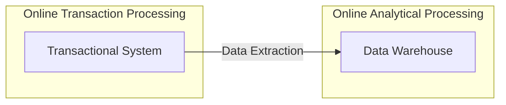
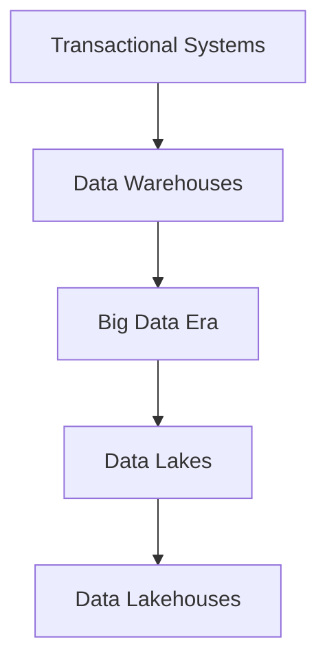

# The Evolution of Data Management: From Transactional Systems to Data Lakehouses

## Introduction

Imagine a journey that starts with early, costly methods of storing data and leads to today's flexible architectures that handle both structured and unstructured information. This story, suited for anyone from students to industry professionals, explains how data management evolved—from early transactional systems focused on reliability and efficiency to modern data lakehouses that combine the benefits of data warehouses and data lakes.

## The Early Era: Transactional Systems and Structured Data

### Costly Beginnings and Selective Storage

In the early days of data management, storage and processing were expensive. Organizations focused on keeping only the most essential data using techniques like **normalization**—a method to reduce redundancy and optimize storage. At that time, every piece of data mattered.

### Building Trust Through Reliable Transactions

During this period, businesses also worked hard to gain customer trust for online interactions. To achieve this, they relied on strong transaction management following the [ACID](https://en.wikipedia.org/wiki/ACID) principles—**Atomicity, Consistency, Isolation, Durability**. Relational Database Management Systems ([RDBMS](https://en.wikipedia.org/wiki/Relational_database)) used normalization along with ACID-compliant transactions to ensure data reliability. Because all the data was highly structured, these systems were known as **transactional systems**.

## The Rise of Business Intelligence and Data Warehouses

### Accumulating Data Across Time and Regions

As companies grew, they started accumulating vast amounts of data across different regions and business partners. With more data available, businesses recognized the need to analyze this information to extract actionable insights. This need led to the development of Business Intelligence (BI) tools that could process large volumes of structured data.

### The Birth of Data Warehouses

To support BI, **data warehouses** were created. These centralized repositories stored large amounts of data, often using designs like **star** and **snowflake schemas** to improve performance—at times by deliberately introducing redundancy. To balance performance with data quality, organizations segregated their systems:
- **Online Transaction Processing (OLTP)** systems handled day-to-day transactions.
- **Online Analytical Processing (OLAP)** systems managed complex analytical queries.

This segregation, known as the OLTP-OLAP model, ensured that transactional systems maintained data integrity while data warehouses provided a foundation for robust analytics. For more details on data warehouses, see [Data Warehouse on Wikipedia](https://en.wikipedia.org/wiki/Data_warehouse).

### Diagram: OLTP and OLAP Segregation

## Technological Advances and the Big Data Revolution

### Hardware Improvements and Optimization Techniques

With time, technological improvements—such as cheaper RAM and persistent storage—allowed both OLTP and OLAP systems to scale. However, even as storage became more affordable, it remained relatively slow. Engineers introduced techniques like network storage, innovative file formats, caching, and cost-based query optimization to bridge the gap between cost and performance.

### The Shift Toward Big Data

Until then, many types of data were often ignored or discarded. Data such as website traffic, system logs, sensor outputs, audio, video, transcripts, and user demographics were stored in unstructured formats and were not integrated into transactional systems. As processing power increased and storage became even cheaper, organizations began mining this previously discarded data. This shift marked the onset of the [Big Data](https://en.wikipedia.org/wiki/Big_data) era, where frameworks like [MapReduce](https://en.wikipedia.org/wiki/MapReduce) allowed distributed processing of enormous data volumes.

### From MapReduce to Apache Spark

The arrival of faster persistent storage like SSDs and the growth of cloud computing led to the development of frameworks such as [Apache Spark](https://spark.apache.org/). Spark’s lazy evaluation model allowed for more efficient processing and challenged the old assumption that data must be fully modeled (schema-on-write) before use.

## The Paradigm Shift: Schema-on-Read and Embracing Unstructured Data

### Rethinking Data Structure

As hardware and processing became more efficient, the traditional approach of structuring data in advance was reexamined. The concept of **schema-on-read** emerged—storing data in its raw form and defining its structure only when needed for analysis. This approach proved particularly valuable for industries like e-commerce, digital delivery, ride-sharing, and subscription services, where speed and flexibility were key.

### Business Implications of Schema-on-Read

By adopting schema-on-read, businesses could store data immediately as it arrived, generating insights more rapidly than competitors. This shift allowed companies to adapt their strategies dynamically, ensuring they were ready to meet market demands without waiting to rigidly model every piece of data.

## The Emergence of Data Lakes

### Storing Everything Together

The need to store both structured and unstructured data led to the development of the **data lake**. A data lake allows organizations to store data in its native form, whether structured, semi-structured, or unstructured. This flexibility ensures that valuable data—once discarded—can now be harnessed for insights. More about data lakes can be found on [Wikipedia’s Data Lake page](https://en.wikipedia.org/wiki/Data_lake).

### The Downside: Data Swamps

While data lakes provided a cost-effective solution for large-scale storage, they also introduced challenges. Without proper management, data lakes could become disorganized, leading to issues with data quality and governance. Poorly managed data lakes were sometimes referred to as "data swamps."

## The Rise of Data Lakehouses: Bridging the Gap

### Finding a Middle Path

The shortcomings of traditional data warehouses and ungoverned data lakes led to the development of a hybrid solution: the **data lakehouse**. This approach seeks to combine the storage flexibility of data lakes with the structure, governance, and analytics capabilities of data warehouses. Learn more about data lakehouses in the [Databricks Glossary](https://databricks.com/glossary/data-lakehouse).

### The Critical Role of a Metadata Layer

A robust metadata layer is key to the data lakehouse architecture. This layer manages schema design, enforces data quality, and ensures governance, providing the benefits of ACID transactions even with asynchronous, raw data ingestion. This architecture allows organizations to enjoy the best of both worlds: flexibility and reliability.

### Modern Implementations: Apache Iceberg

Technologies like [Apache Iceberg](https://iceberg.apache.org/) exemplify the data lakehouse approach by providing efficient, scalable table formats for large analytic datasets. These technologies ensure that data remains consistent and reliable as it is updated concurrently. Despite advances by major players like [Oracle](https://www.oracle.com/database/) and cloud-native solutions like [Snowflake](https://www.snowflake.com/), many challenges in data governance remain—underscoring the importance of a balanced, unified approach.

### Diagram: The Evolution of Data Management

## Looking Ahead: The Future of Data Management

The evolution from transactional systems to data lakehouses illustrates the dynamic nature of technology and business needs. Today, organizations must store data as it arrives, analyze it quickly, and adapt in real time. As the volume and diversity of data continue to grow, the solutions we build must be both flexible and reliable.

The data lakehouse model represents a promising path forward, addressing the limitations of traditional systems while providing a scalable foundation for future innovations. As technology evolves, we can expect even more integrated solutions that further bridge the gap between structure and flexibility.

## Conclusion

The story of data management is one of continuous adaptation and innovation. We began with tightly controlled transactional systems built on normalization and ACID principles. Then came the era of data warehouses and BI tools, followed by the Big Data revolution that embraced previously discarded unstructured data. Finally, the emergence of data lakes—and now data lakehouses—reflects our ongoing quest to store, process, and extract value from data in ever more efficient ways.

As we move forward, the evolution of data management will continue to shape how we harness information for smarter decisions, ensuring that businesses remain agile in an increasingly data-driven world.
