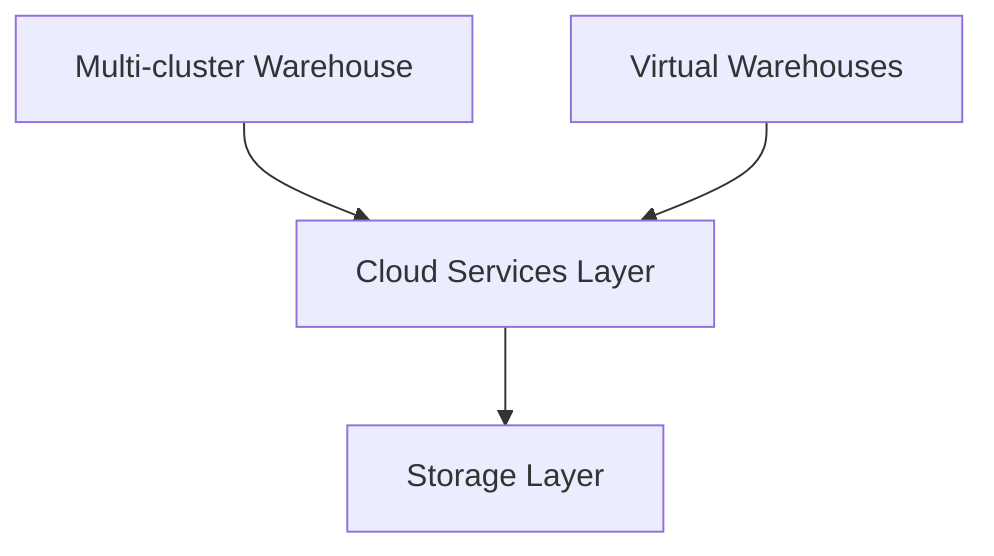
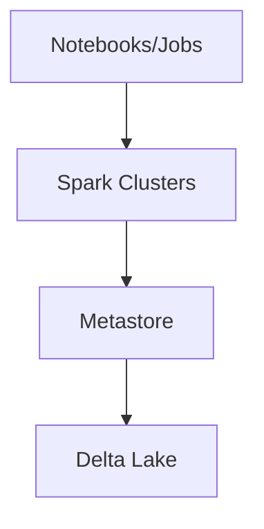
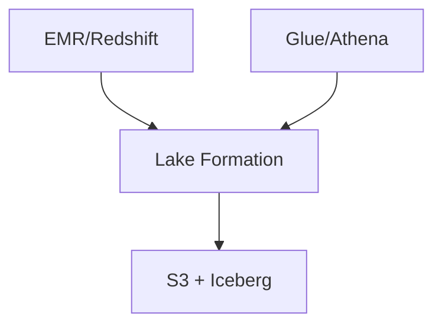

# Technical Deep Dive: Data Lakehouse Platforms

This document provides a technical deep dive into the platforms compared in the [Lakehouse Platform Comparison](./lakehouse_platform_comparison.md) document.

## Core Components Comparison

### Storage Layer
| Platform | Format | Partitioning | Compression | Cost ($/TB/month)* |
|----------|---------|--------------|-------------|-------------------|
| Snowflake | Micro-partitions | Automatic | Automatic | $23-40 |
| Databricks | Delta Lake (Parquet) | User-defined | Configurable | $20-35 |
| Azure | ADLS Gen2 | Hierarchical | Multiple options | $18-30 |
| AWS | S3 + Iceberg | Path-based | Multiple options | $21-35 |
| Oracle | Object Storage | Custom | Advanced | $25-45 |

### Query Engine Performance
| Platform | Query Type | Cold Start | Cached | Concurrent Users |
|----------|------------|------------|--------|------------------|
| Snowflake | OLAP | 2-5s | <1s | 500+ |
| Databricks | Spark SQL | 20-30s | 1-2s | 100+ |
| Azure Synapse | T-SQL | 1-3s | <1s | 300+ |
| Redshift | PostgreSQL | 2-4s | <1s | 200+ |
| Oracle | PL/SQL | 1-2s | <1s | 400+ |

## Architecture Patterns

### Snowflake Pattern


### Databricks Pattern


### AWS Pattern


## Migration Complexity Matrix

| From → To | Snowflake | Databricks | Azure | AWS | Oracle |
|-----------|-----------|------------|--------|-----|---------|
| Snowflake | - | Medium | Medium | Medium | High |
| Databricks | Medium | - | Low | Low | High |
| Azure | Medium | Low | - | Medium | High |
| AWS | Medium | Low | Medium | - | High |
| Oracle | High | High | High | High | - |

## Performance Optimization Tips

### Snowflake
- Use clustering keys for frequently filtered columns
- Leverage materialized views for common queries
- Size warehouses appropriately for workload
```sql
ALTER TABLE sales CLUSTER BY (date_key, region);
CREATE MATERIALIZED VIEW daily_sales AS SELECT...;
```

### Databricks
- Use Z-Ordering for multi-dimensional filtering
- Optimize file sizes with OPTIMIZE command
- Leverage Photon engine for CPU-intensive queries
```sql
OPTIMIZE sales ZORDER BY (date_key, region);
ALTER TABLE sales SET TBLPROPERTIES('delta.targetFileSize'='256MB');
```

### AWS
- Use partition pruning effectively
- Implement compress/compact operations
- Utilize the right instance types for workload
```sql
ALTER TABLE sales ADD PARTITION field(date_key) type(date);
VACUUM sales RETAIN 168 HOURS;
```

## Cost Optimization Strategies

### Storage Optimization
- Snowflake: Time-travel and fail-safe period configuration, data compression
- Databricks: Delta Lake VACUUM and OPTIMIZE commands, data tiering
- AWS: S3 lifecycle policies and storage tiers, intelligent tiering

### Compute Optimization
- Snowflake: Auto-suspend and auto-resume configurations, scaling virtual warehouse size
- Databricks: Cluster autoscaling and spot instances, optimized Spark configurations
- AWS: EMR managed scaling and Spot Instances, right-sizing EC2 instances

## Data Governance

### Snowflake
- Data Lineage: Available through partner integrations
- Data Catalog: Integrates with external data catalogs
- Data Quality: Monitoring through SQL-based checks

### Databricks
- Data Lineage: Integrated with Unity Catalog
- Data Catalog: Unity Catalog
- Data Quality: Delta Live Tables for data quality enforcement

### AWS
- Data Lineage: AWS Glue DataBrew
- Data Catalog: AWS Glue Data Catalog
- Data Quality: AWS Deequ

## Security Summary

| Platform  | Encryption         | Access Control        | Compliance                |
|-----------|--------------------|-----------------------|---------------------------|
| Snowflake | AES-256 (at rest & transit) | RBAC, network policies | SOC 2, HIPAA, GDPR       |
| Databricks| At rest & transit  | Unity Catalog, RBAC   | SOC 2, HIPAA, GDPR        |
| AWS       | S3 encryption, KMS | IAM, VPC              | SOC 2, HIPAA, GDPR        |

## Security Features

### Snowflake
- Encryption: At rest and in transit (AES-256)
- Access Control: RBAC, network policies
- Compliance: SOC 2, HIPAA, GDPR

### Databricks
- Encryption: At rest and in transit
- Access Control: Unity Catalog, RBAC
- Compliance: SOC 2, HIPAA, GDPR

### AWS
- Encryption: S3 encryption, KMS
- Access Control: IAM, VPC
- Compliance: SOC 2, HIPAA, GDPR

## Real-World Performance Metrics*

*Disclaimer: These performance figures are based on typical deployments. Actual results depend on workload characteristics, configuration, and data scale.*

| Scenario | Snowflake | Databricks | Azure | AWS |
|----------|-----------|------------|--------|-----|
| 1TB Join | 45s | 55s | 50s | 48s |
| Window Func | 30s | 35s | 32s | 33s |
| ML Training | 180s | 150s | 165s | 160s |
| Streaming | 100k/s | 150k/s | 120k/s | 130k/s |

*These are approximate figures based on typical deployments. Actual performance depends on configuration and workload.

## Decision Matrix for Enterprise Architects

### When to Choose Each Platform

#### Snowflake
✅ Strong data sharing requirements
✅ Need for immediate query performance
✅ Limited DevOps resources

#### Databricks
✅ Heavy ML/AI workloads
✅ Spark expertise in team
✅ Need for unified analytics platform

#### Azure Synapse
✅ Existing Microsoft ecosystem
✅ Hybrid cloud requirements
✅ .NET development team

#### AWS
✅ Existing AWS infrastructure
✅ Need for wide service integration
✅ Cost-sensitive deployments

### Critical Success Factors

1. **Data Volume and Velocity**
   - Low (<1TB): Any platform suitable
   - Medium (1-100TB): Consider cost optimization
   - High (>100TB): Evaluate scaling capabilities

2. **Team Skills**
   - SQL-focused: Snowflake/Azure
   - Spark/Python: Databricks
   - Mixed: AWS/Azure

3. **Integration Requirements**
   - Internal systems
   - External partners
   - Real-time vs. batch

4. **Budget Constraints**
   - Initial setup costs
   - Operational costs
   - Training requirements
